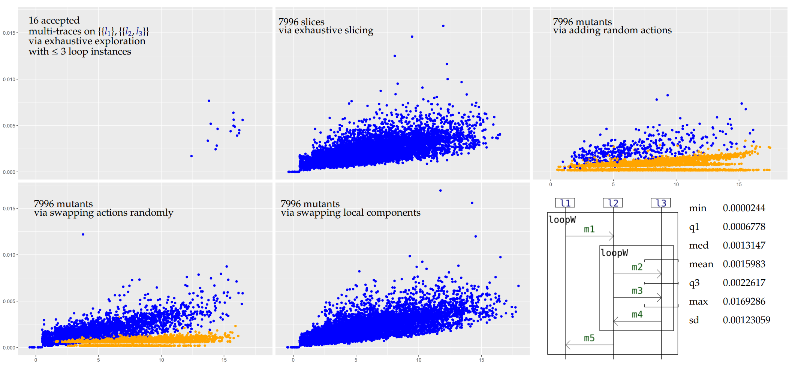
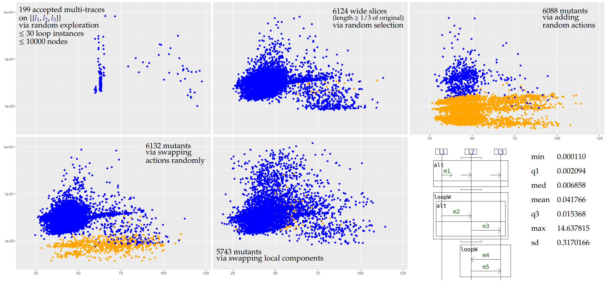

# A small experiment on the use of the simulation-based algorithm of HIBOU to recognize multi-slices and their mutants via ORV from interaction models

Multi-traces are sets of local traces, each corresponding to a sequence of communication actions (emissions or receptions of messages) 
that are observed locally on a specific sub-system or set of co-localized sub-systems.
A multi-trace is hence a collection of local observations of the same global behavior (which is what was executed in the distributed system).

However, local observers - which task is to collect those local traces - may not be well synchronized w.r.t. one another.
As a result, the moments at which observation starts may not be well synchronized in distant observers
and, likewise, the moments at which observation stops may not be well synchronized in distant observers.
Moreover those moments may not correspond to the intended start and end of osbervation which corresponds to the observation of a full execution of the distributed system.

As a consequence, the multi-trace which is observed is a slice of the multi-trace which would be observed in ideal conditions of observation.

This case of partial observation can be handled via a simulation-based algorithm provide Offline Runtime Verification from interaction models.
This approach is different from the [lifeline-removal-based technique used here to identify multi-prefixes](https://github.com/erwanM974/hibou_hiding_usecases).

As a specification language for assessing the conformance of multi-traces logged during the execution of a distributed system, 
we use a language of "interactions".
Interactions are formal models,
akin to Message Sequence Charts or UML Sequence Diagrams for their graphical representation,
but more related to process algebra for their structure and the manner in which we exploit them, via an operational-style semantics.

This experiment constitutes a small-scale experimental validation of the simulation-based algorithm which is implemented in the HIBOU tool
(see "[hibou_label](https://github.com/erwanM974/hibou_label)").

## Generating input data

For every interaction *i* from our set of usecase interactions *I*, 
we generate a number of accepted multi-traces 
using the semantics exploration feature of HIBOU and a trace generation logger.
For each *i* a set *T(i)* of such accepted multi-traces is thus obtained.
Given the presence of loops in models, *T(i)* is defined by limiting the exploration according to certain criteria.

For every such accepted multi-trace, we then generate a number of slices by removing events at the beginning and/or the end of its local trace components.
We thus obtain a set *S(i)* of slices.

Finally, for every such slice, we perform some mutations so as to obtain mutant multi-traces which may (or may not) go out of specification.
We consider three distinct kinds of mutation:
- swapping the order of actions within a given trace component of a given multi-trace
- inserting random actions within a given multi-trace (respecting the composition of its components i.e. the lifelines on which actions are supposed to occur)
- swapping components on the same co-localization between two different multi-traces (this mutation is interesting given that it ensures every local component to remain correct even though the global scenario i.e. multi-trace may then not be correct)

In "i1_i2_pregen_data.zip" you will find pre-generated data that were used to perform the experiment and plot the results.
Given the non-derministic nature of the exploration for the second example (i2) a different dataset may be generated during another exploration.

## Running the experiment:

We analyse all the multi-traces against their corresponding interaction specification using a certain configuration of HIBOU.
In order to test a feature of 'local analysis' of the tool, we use two different configurations of the analysis algorithm.
Concretely, we run two instances of hibou in parallel with both configurations.
When the quickest terminates we kill the slowest and take note of which configuration is quicker.

We take note of the time required to finish the analysis and produce a verdict.
In order to smooth the results by removing noise, we perform several tries (5) and
then consider the median time required for the analysis between those 5 tries for plotting the results.

For each interaction, we generate a ".csv" file containing the experimental data. 
We then plot the results using a R script.

## Exploiting and plotting the data:

In the following we present results obtained running the experiment on an i5-8250U processor and 32Go of RAM.
We have used HIBOU version 0.8.4.

With the R code comprised in this repository, we extract statistical information from the "csv" tables that are generated
and draw scatterplots to represent the results graphically.

In those plots, each point corresponds to a given multi-trace.
Its position corresponds to the time taken to analyse it (on the *y* axis), and its length i.e. total number of actions (on the *x* axis, with some jitter added to better see distinct points).
The color represents the verdict, 
*blue* for Pass 
and 
*orange* for Inconc.

The raw data used to produce the following plot is given in the "i1_results_on_pregen_data.csv" and "i2_results_on_pregen_data.csv" files.

For the first example we propose 
a shallow but exhaustive exploration of the input model's semantics (i.e. all traces that can be expressed whenever we instantiate up to 3 loops)
and an exhaustive slicing (i.e. we consider all the possibles slices of the multi-trace obtained during exploration).

For the second example we propose a partial and random but in depth exploration and a random selection of wide slices (length ≥ 1/3 of original).

## Interpretation of the results

### Input interaction and multi-trace.

We can at first notice that the performances of the algorithm are highly dependent on the nature of the input interaction. 
The more the interaction offers branching choices (loops, alternatives) and possible interleavings (weak sequencing and interleaving), 
the greater can the size of graph be, with, as a consequence, worse performances. 
While example i1 is rather sequential, this is not the case for i2.

The dependence w.r.t. the size of the input multi-trace seems to be linear for example i1
and is less noticeable for example i2 (the analysis time is much more dependent on the structure of the input multi-trace w.r.t. the interaction rather than on its size).

### Slices.

Our criterion is capable of correctly identifying slices in most cases, as illustrated with i1 and i2 (top middle plots). 
For i1, we consider all the possible slices (7996) of the accepted multi-traces obtained during the exploration and all of them are correctly identified (drawn in blue). 
Even though for i2 we consider slices of much larger multi-traces (up to 30 instances of the loops of i2 may be instantiated), most of those are still correctly identified.
The few inconclusive verdicts correspond to cases where the criterion does not allow enough simulation steps.

### Mutants by adding random actions.

In most cases, when we add a random action to a multi-trace which is conform to a specification, it becomes non-conform. 
This is reflected on the top right plots for both i1 and i2 by the fact that most multi-trace analyses are inconclusive (orange points).
Because of the limitations of our criterion, we cannot return a Fail verdict.
In terms of performances, we can obtain the inconclusive verdicts more quickly on average than the pass verdicts because we use some optimisations on the exploration of the graph 
(we use local analyses to cut parts of the graph).

### Mutants by swapping actions within a multi-trace.

If the specifying interaction allows many possible interleaving of actions, it may be so that swapping the positions of actions of a conform slice yields a new multi-trace which is also conform. 
On the bottom left plots for both i1 and i2 we can see that those mutants may still be conform in many cases.

### Mutants by swapping local components of two distinct multi-traces.

This family of mutants is quite interesting given that for any such mutant obtained from two conform slices, the local components of the mutant are still all locally conform to the specification. 
This makes techniques such as the use of local analyses to reveal non-conformities useless. 
If the mutant is non-conform then only a global analysis - i.e. matching the multi-trace to an accepted global scenario - can identify this non-conformity.
In any case, because we only consider a labelled language (i.e. no message passing and no value passing), most of those mutants are conform. 
With message passing there would likely be mismatches between the messages that are passed between non-co-localised lifelines.
Still, in our purely labelled framework, some inconclusive verdicts are present for i2.

